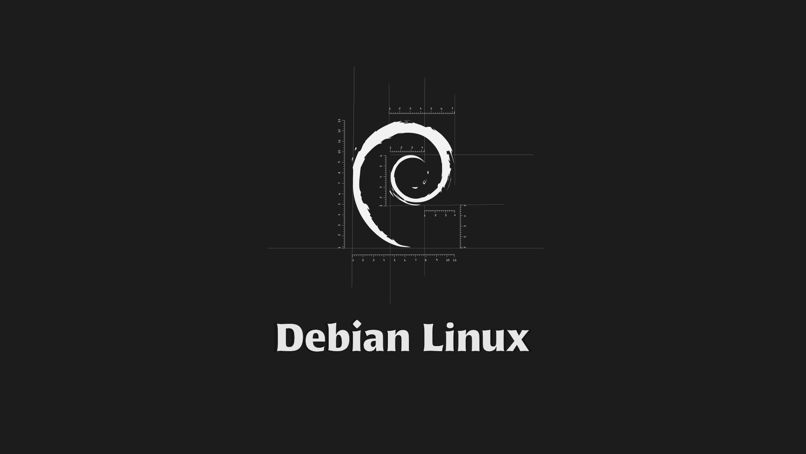

## 写在前面
我是南昌航空大学洪鹰战队22级电控组成员，在学习和备赛的过程中使用过很多开发环境，从Keil到CubeIDE，再到VScode，最后还是觉得VScode使用起来比较方便。在24赛季的备赛过程中，我们接触并使用了湖南大学跃鹿战队的开源电控框架basic_framework，感受到了使用Ozone进行调试的方便性，由此产生了探索的小兴趣。

在联盟赛结束后我开始探索Ubuntu系统下的STM32开发环境的搭建，并在一次次试错中总结出了一个较为方便的开发环境搭建过程，故写下此篇博客用以记录，方便后面重装系统后能够快速重建开发环境，也为从事相关开发工作的同学们提供一个思路。

> 在此感谢湖南大学跃鹿战队电控开源框架basic_framework提供的环境搭建思路，附上框架链接：[***basic_framework***](https://github.com/HNUYueLuRM/basic_framework)


#  一、Ubuntu系统的安装
## 1、启动盘的制作和双系统的安装
这里推荐一个b站的视频，这个UP主讲的非常细，Ubuntu的启动盘制作可以参考这个视频[***Windows 和 Ubuntu 双系统的安装和卸载***](https://www.bilibili.com/video/BV1554y1n7zv/?spm_id_from=333.1007.top_right_bar_window_custom_collection.content.click&vd_source=db1d1f91faddd9a92b98355deb2f94a6)
> 个人建议：关于内存分布这块，建议至少120G，且直接挂载一个根节点，能提高内存空间利用率。<br/>
> 个人建议：自备一个大容量高速U盘或机械硬盘，每隔一段时间将自己重要的资料或工程文件都重新备份一份，~~因为永远不知道Ubuntu会在什么时候突然崩溃~~。

## 2、更改Ubuntu时间
双系统会导致Ubuntu比Windows的时间快8小时，而Windows的时间比Ubuntu慢8小时，所以需要解决系统时间同步的问题。还是第一次分享的那个视频，后面有一节讲到了时间同步的问题。[***系统时间同步问题***](https://www.bilibili.com/video/BV1554y1n7zv?p=9&vd_source=db1d1f91faddd9a92b98355deb2f94a6)
> 个人建议：打开字幕观看，因为有些莫名出现的问题，会在弹幕里有解答

# 二、配置C/C++环境
打开终端，以此输入以下命令来安装gcc、g++、gdb
## 1、安装gcc
```bash
sudo apt-get install gcc
```
## 2、安装g++
```bash
sudo apt-get install g++
```
## 3、安装gdb（调试用）
```bash
sudo apt-get install gdb
```
## 4、运行以下三条命令来看是否安装成功
```bash
gcc -v
```

```bash
g++ -v
```

## 5、可以使用vim或gedit来编写一段简单的代码运行一下（可跳过）
对于代码或一个工程，最好是使用专属的文件夹来进行分类管理，这样会显得很有条理，管理起来也方便。例如在此处，我在主目录下创建了/Project/CxC++/test，test即是我的工程文件名，在这里面我们写一个C++程序来进行简单的验证。（以vim为例）
### （1）首先安装vim
```bash
sudo apt-get install vim
```
### （2）使用vim创建hello.cpp
```bash
vim hello.cpp
```
### （3）成功创建hello.cpp后，进行代码编写：
关于vim的操作，感兴趣的同学可以上网搜索相关资料进行学习，在这里我就不班门弄斧了，简单的操作一下：<br/>
1.使用vim创建hello.cpp后，可以看到如下的场景

