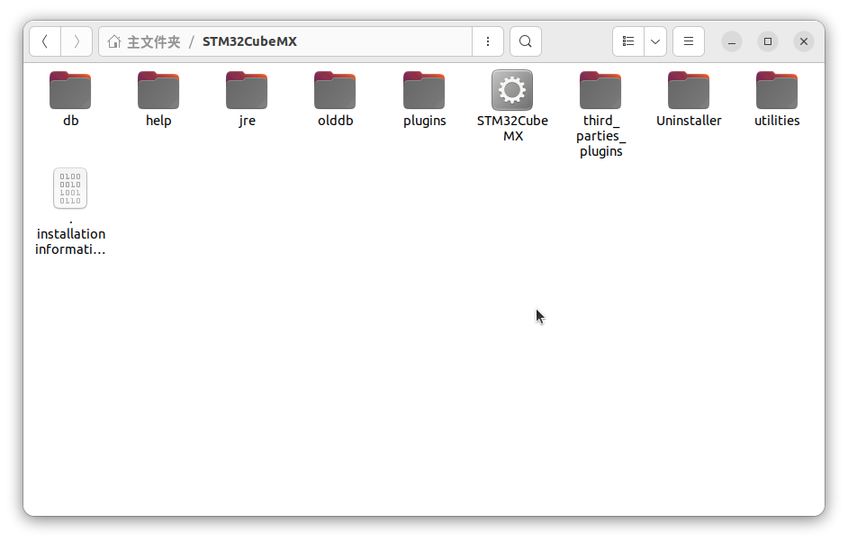
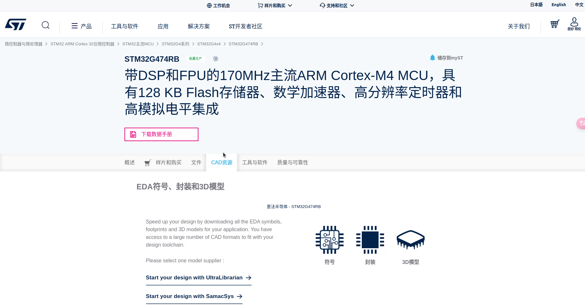
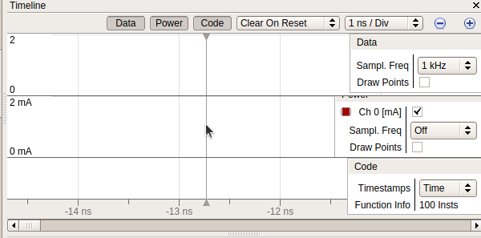

## 写在前面
撰写本文档的目的起初是为了记录一遍开发环境搭建的过程，方便后面重装系统后能够快速重建开发环境，也为从事相关开发工作的同学们提供一个思路。为什么选择在Ubuntu上搭建？我也说不上为什么，只是我发现在这个系统里学习和做开发会让我更集中精力，不那么想要玩游戏(~~因为想要玩游戏得去重启切换系统进Win~~)。

有些电控组的成员会学习ROS2，所以在Ubuntu上搭建开发环境无疑省去了切换系统的麻烦，目前队内已有很多成员选择了使用Ubuntu来开发STM32，在搭建的过程中也帮我找出了之前一些不合理的地方，所以在闲暇之余我将之前发布的博客重新整理了一遍，修改了已发现的错误，更新和删除了部分内容，并将所用到的软件包和工具链统一上传到仓库当中，不必像之前一样一个一个的点击网盘下载了。同时也保存了软件包和工具链的官网下载地址，方便日后更新。

当然，如果只记录开发环境搭建，那就不用这么大篇幅，三言两语的就能带过了，既然是发出来给大家看的，那就不能太随意，所以文档中配了很多搭建过程的截图，方便大家对照查看。同时也写了很多相关软件和工具的基本使用方法，帮助大家熟悉并掌握。

> 在此感谢湖南大学跃鹿战队电控开源框架basic_framework提供的环境搭建思路，附上框架链接：[***basic_framework***](https://github.com/HNUYueLuRM/basic_framework)


#  一、Ubuntu系统的安装
## 1、启动盘的制作和双系统的安装
这里推荐一个b站的视频，这个UP主讲的非常细，Ubuntu的启动盘制作可以参考这个视频[***Windows 和 Ubuntu 双系统的安装和卸载***](https://www.bilibili.com/video/BV1554y1n7zv/?spm_id_from=333.1007.top_right_bar_window_custom_collection.content.click&vd_source=db1d1f91faddd9a92b98355deb2f94a6)
> 个人建议：关于内存分布这块，建议至少120G，且直接挂载一个根节点，能提高内存空间利用率。<br/>
> 个人建议：自备一个大容量高速U盘或机械硬盘，每隔一段时间将自己重要的资料或工程文件都重新备份一份，~~因为永远不知道Ubuntu会在什么时候突然崩溃~~。

## 2、更改Ubuntu时间
双系统会导致Ubuntu比Windows的时间快8小时，而Windows的时间比Ubuntu慢8小时，所以需要解决系统时间同步的问题。还是第一次分享的那个视频，后面有一节讲到了时间同步的问题。[***系统时间同步问题***](https://www.bilibili.com/video/BV1554y1n7zv?p=9&vd_source=db1d1f91faddd9a92b98355deb2f94a6)
> 个人建议：打开字幕观看，因为有些莫名出现的问题，会在弹幕里有解答

# 二、配置C/C++环境
打开终端，以此输入以下命令来安装gcc、g++、gdb
## 1、安装gcc
```bash
sudo apt-get install gcc
```
## 2、安装g++
```bash
sudo apt-get install g++
```
## 3、安装gdb(调试用)
```bash
sudo apt-get install gdb
```
## 4、运行以下三条命令来看是否安装成功
```bash
gcc -v
```

```bash
g++ -v
```

```bash
gdb -v
```

## 5、编写代码运行（可跳过）
可以使用vim或gedit，对于代码或一个工程，最好是使用专属的文件夹来进行分类管理，这样会显得很有条理，管理起来也方便。例如在此处，我在主目录下创建了/Project/CxC++/test，test即是我的工程文件名，在这里面我们写一个C++程序来进行简单的验证。(以vim为例)
### (1)安装vim
```bash
sudo apt-get install vim
```
### (2)使用vim创建hello.cpp
```bash
vim hello.cpp
```
### (3)成功创建hello.cpp后，进行代码编写：
关于vim的操作，感兴趣的同学可以上网搜索相关资料进行学习，在这里我就不班门弄斧了，简单的操作一下：<br/>
1.使用vim创建hello.cpp后，可以看到如下的场景<br/>
<br/>
2.按下“i”键，进入编辑模式(左下角也有提示“插入”)<br/>
<br/>
3.进行简单的代码编写<br/>
<br/>
4.编辑完成后，先按一次“ESC”，此时左下角的“插入”会消失，然后同时按下“Shift”和“：”键，待下方出现“：”后，输入wq，然后按下回车。(wq表示保存并退出)<br/>
<br/>
5.编写完成后，执行下面的命令对cpp文件进行编译
```bash
g++ -o hello hello.cpp
```
<br/>
6.执行编译好的.o文件，验证运行效果<br/>

# 三、安装、配置VScode
## 1、下载VScode
前往VScode的官网进行下载，注意选择下载.deb
[***Visual Studio Code - Code Editing. Redefined***](https://code.visualstudio.com/)<br/>

## 2、准备安装
下载完成之后，在所属文件夹打开终端(一般默认是在“下载”里的)<br/>

## 3、安装VScode
执行如下命令，安装VScode，注意后面的.deb文件版本要对应自己所下载的版本，我这里以1.89为例(dpkg是Debian 系统中的软件包管理工具，感兴趣的可以自己去了解，这里就不多赘述了)
```bash
sudo dpkg -i code_1.96.4-1736991114_amd64.deb
```

## 4、安装必要的插件
### (1)简体中文插件
一般首次进入后都会在右下角提示你安装的，如果没有提示就自己去搜索安装(注：安装完后需要重启软件才会生效)<br/>

### (2)C/C++插件
在左侧扩展商店中搜索“C/C++”，选择第一个进行安装<br/>

## 5、进行测试
创建一个新工程，并使用VScode打开，创建第一个.cpp文件进行测试
### (1)打开工程文件夹
我这里以创建一个test2文件夹为例(新建“test2”文件夹，右键选择“使用其它程序打开”，选择使用VScode打开)<br/>

### (2)创建main.cpp

### (3)编写测试代码
```c
#include<iostream>
 
int main()
{
    std::cout << "Hello VScode ubder Ubuntu!!" << std::endl;
    return 0;
}
```

### (4)配置json文件
配置.vscode里的相关.json文件，可以选择右键新建名为“.vscode”的文件夹，然后手动创建以下三个.json文件<br/>
<br/>
**launch.json:**
```json
{
    "version": "0.2.0",
    "configurations": [
    {
        "name": "(gdb) Launch",
        "type": "cppdbg",
        "request": "launch",
        "program": "${workspaceFolder}/${fileBasenameNoExtension}.out",
        "args": [],
        "stopAtEntry": false,
        "cwd": "${workspaceFolder}",
        "environment": [],
        "externalConsole": true,
        "MIMode": "gdb",
        "preLaunchTask": "build",
        "setupCommands": [
            {
            "description": "Enable pretty-printing for gdb",
            "text": "-enable-pretty-printing",
            "ignoreFailures": true
            }
        ]
    }
    ]
}
```
**settings.json:**
```json
{
    "files.associations": {
        "ostream": "cpp",
        "iostream": "cpp",
        "array": "cpp",
        "atomic": "cpp",
        "bit": "cpp",
        "*.tcc": "cpp",
        "cctype": "cpp",
        "clocale": "cpp",
        "cmath": "cpp",
        "compare": "cpp",
        "concepts": "cpp",
        "cstdarg": "cpp",
        "cstddef": "cpp",
        "cstdint": "cpp",
        "cstdio": "cpp",
        "cstdlib": "cpp",
        "cwchar": "cpp",
        "cwctype": "cpp",
        "deque": "cpp",
        "string": "cpp",
        "unordered_map": "cpp",
        "vector": "cpp",
        "exception": "cpp",
        "algorithm": "cpp",
        "functional": "cpp",
        "iterator": "cpp",
        "memory": "cpp",
        "memory_resource": "cpp",
        "numeric": "cpp",
        "random": "cpp",
        "string_view": "cpp",
        "system_error": "cpp",
        "tuple": "cpp",
        "type_traits": "cpp",
        "utility": "cpp",
        "initializer_list": "cpp",
        "iosfwd": "cpp",
        "istream": "cpp",
        "limits": "cpp",
        "new": "cpp",
        "numbers": "cpp",
        "stdexcept": "cpp",
        "streambuf": "cpp",
        "typeinfo": "cpp"
    }
}
```
**tasks.json:**
```json
{
    "version": "2.0.0",
    "tasks": [
    {
    "label": "build",
    "type": "shell",
    "command": "g++",
    "args": ["-g", "${file}", "-std=c++11", "-o", "${fileBasenameNoExtension}.out"]
    }
    ]
}
```
### (5)编译运行
回到main.cpp，按下F5进行编译运行(实际上是调试，如果打了断点的话会停在断点)<br/>

# 四、安装、配置arm-none-eabi-gcc交叉编译工具链
关于交叉编译工具链的下载，有很多种方法，可以前往官网下载
[Downloads | GNU Arm Embedded Toolchain Downloads – Arm Developer](https://developer.arm.com/downloads/-/arm-gnu-toolchain-downloads)
或者直接使用我上传在天翼云盘的资源(因为百度网盘没有会员的话下载会非常慢)访问码：pgn6
[arm-gnu-toolchain-13.2.Rel1-x86_64-arm-none-eabi编译工具链下载](https://cloud.189.cn/web/share?code=nMv6Bn67b2Az%EF%BC%88%E8%AE%BF%E9%97%AE%E7%A0%81%EF%BC%9Apgn6%EF%BC%89)
下载结束后，打开所在文件夹终端(建议将该压缩包转移到一个不常更改的文件夹里，可以新建)，输入以下命令进行解压：
```bash
tar -xvf arm-gnu-toolchain-13.2.rel1-x86_64-arm-none-eabi.tar.xz
```
压后得到一个同名文件夹<br/>

复制可执行文件“bin”的路径，操作如下：

(1)进入“arm-gnu-toolchain-13.2.Rel1-x86_64-arm-none-eabi”文件夹<br/>
(2)进入“bin”文件夹<br/>
(3)在空白处右键，选择“在终端打开”<br/>
(4)输入以下指令查看路径
```bash
pwd
```
如图白色部分所示就是bin文件的路径，选择后按住“Shift”+“Ctrl”+“c”进行复制<br/>
<br/>
打开终端，输入下面的指令，打开profile文件(不加sudo的话只能以“只读”打开)
```bash
sudo vim /etc/profile
```
在打开的文件末尾输入以下内容(注：$PATH:后面的链接为我们刚复制的bin的链接，配置时需要根据实际情况进行修改)
步骤：<br/>
(1)输入“i”进入插入模式<br/>
(2)将光标移动到末行后，回车另起一行<br/>
(3)输入前面的export PATH=$PATH:<br/>
(4)按住“Shift”+“Ctrl”+“v”进行粘贴<br/>
(5)按下Esc，然后按下“Shift”+“：”，输入“wq”，保存修改并退出
```bash
export PATH=$PATH:/home/yml/mondrian/arm-gnu-toolchain-13.2.Rel1-x86_64-arm-none-eabi/bin
```
<br/>
执行如下命令，然后重启电脑/虚拟机使环境变量生效
```bash
source profile
```
重启完成后执行以下命令看是否配置成功
```bash
arm-none-eabi-gcc -v
```
<br/>
# 五、JLink驱动
## 1、安装libreadline库
我们烧录会用到JLinkExe的命令，而JLinkExe会用到libreadline库，所以要安装libreadline库，执行如下命令安装：
```bash
sudo apt-get install libreadline-dev
```
## 2、下载JLink驱动
进入SEGGER的官网，下载JLink驱动(选择Linux下的64-bit DEB Installer)
[SEGGER - The Embedded Experts - Downloads - J-Link / J-Trace](https://www.segger.com/downloads/jlink/)<br/>
<br/>
> 现在出了V8版本的驱动，我没有尝试过，有兴趣的可以自行更新，目前我们使用V7的也够用，Installation_package中V7和V8的驱动都有。

官网下载速度应该会特别慢，这里可以选择我上传到云盘的资源(v792o版本)：<br/>
天翼云盘(访问码b4oi)：
[JLink驱动](https://cloud.189.cn/web/share?code=FzyMRvYFz2ye%EF%BC%88%E8%AE%BF%E9%97%AE%E7%A0%81%EF%BC%9Ab4oi%EF%BC%89)
## 3、安装JLink驱动
下载好后，打开.deb文件所在的文件夹，打开终端，执行以下命令进行安装：
```bash
sudo dpkg -i JLink_Linux_V792o_x86_64.deb
```
因为我之前已经安装过了，所以这里显示“覆盖”<br/>

## 4、查看JLink版本
执行如下命令来查看Jlink版本，验证是否安装成功
```bash
jlink --version
```

## 5、进入SEGGER查看相关可执行文件
输入以下命令，然后执行“ls”查看相关的可执行文件(一般默认安装位置都是在/opt下的)
```bash
cd /opt/SEGGER/JLink
```

# 六、J-Link Commander交互模式初体验
## 1、直接执行JLinkExe命令
主要是为了验证一下是否安装成功，执行以下命令，进入J-Link Commander交互模式
```bash
JLinkExe
```
此时如果没有链接Jlink的话会出现这个界面：<br/>
<br/>

我们点击No，然后会进入Commander交互模式，在这种模式下，我们可以执行各种 J-Link Commander 提供的命令来连接、配置调试器，下载程序或文件到目标设备等操作，感兴趣的同学可自行学习。

执行“q”指令退出该模式。<br/>
<br/>
## 2、初次尝试使用JLinkExe来与设备建立连接
链接一块开发板
> (我这里使用自制的G474作为演示，XH2.54转MX1.25的转接线需要自己焊接，注意和原理图对上线序，大家使用F103C8T6的最小系统板时，注意杜邦线对上线序即可)

<br/>
当然，如果我们接入Jlink设备后，再执行这个命令会提示你执行“connect”来与设备进行链接，或者输入“?”来查看更多的指令帮助。<br/>
<br/>
我们输入“connect”后，会返回我们连接的开发板芯片的信息，并让我们确认，可以看到这里芯片信息返回错误，我们需要输入芯片型号来设置Device(这里以STM32G474RB为例)<br/>
<br/>
选择连接接口为SWD(或JTAG，根据实际需求来看)<br/>
<br/>
选择传输速度，默认4000kHz，我们可以自行修改，比如我这里设置2000kHz<br/>
<br/>
按下回车后，等待几毫秒便会提示连接成功了(会打印检测到的芯片以及寄存器信息等，例如我们可以找到熟悉的“Cortex-M4”)<br/>
<br/>
假设这里我们已经编译得到了一个test.bin或test.hex文件，那么到这一步后，我们就可以使用下面两条命令来实现烧录.bin文件或.hex文件了(这里不做演示，只做说明)<br/>
```bash
loadbin ./test.bin,0x08000000
```
```bash
loadfile ./test.hex
```
然后执行“q”退出Commander模式。<br/>
<br/>
# 七、安装CubeMX
## 1、安装Java环境
打开终端，输入下面的指令安装Java运行环境
```bash
sudo apt install default-jre
```
安装完成后，输入下面的指令验证是否安装成功
```bash
java --version
```
<br/>
## 2、安装CubeMX
前往官网下载CubeMX软件包(现已出至6.13版本，由于6.12版本有点问题，所以我们一直使用6.11版本，这个版本较稳定，软件包中提供6.11版本，想使用高版本可自行下载)
[STM32CubeMX软件下载](https://www.st.com/zh/development-tools/stm32cubemx.html#overview)<br/>
<br/>
之后会弹出一个许可协议，我们选择同意后，会弹出选择下载身份的界面，可以右下角选择访客下载，也可以注册一个ST账号后再登录下载，这里建议注册一个账号后再下载<br/>
> (注：无论是选择访客下载还是注册后下载，软件的下载链接都会发送到你填写的邮箱里，所以请确保你的邮箱是在电脑上打开的)

<br/>
将下载好的包解压后，进入，双击运行“SetupSTM32CubeMX-6.11.1”(以实际下载的版本为主)<br/>
<br/>
然后根据向导一步步进行安装，注意选择一个能容得下的盘<br/>

安装完成后，打开刚刚选择的安装位置(例如我这里是/home/yml/STM32CubMX)，双击“STM32CubeMX”启动程序<br/>
<br/>
**登录之后**，点击右边栏的"INSTALL/REMOVE"或“Help”->“Manage embedded sofeware packages”<br/>
<br/>
选择自己需要的芯片型号的HAL库包，选好之后点击“INSTALL”，想移除某软件包也可以在这个界面选择，然后点“REMOVE”<br/>
<br/>
(关于工程的创建过程，可以自行搜索学习，这里就不赘述了，只需注意一点：Project Maneger那里的Toolchain/IDE要选择Makefile)<br/>
<br/>
# 八、编写JLink烧录脚本并修改Makefile
## 1、打开工程
使用VScode打开一个新建好的工程<br/>
<br/>
## 2、编写代码
打开main.c，随便写点什么，~~比如这里来个经典点灯~~<br/>
<br/>
## 3、编译
在底部的终端栏里执行以下指令进行编译
> ("-j16"这里的16对应电脑核心线程，我的是16线程的，所以是-j16，根据电脑实际硬件配置进行修改，例如CPU是20线程的就改为-j20，~~其实写多少都无所谓，咱不差这点时间~~)
```bash
make -j16
```
<br/>
执行后可以看到编译好的.elf、.hex、.bin文件<br/>
<br/>
## 4、编写JLinkScript脚本
在工程主目录下创建一个.JLinkScript脚本文件(为了后续移植到其他工程较方便，建议统一命名为STM32.JLinkScript)，并编写以下内容
```bash
speed 2000
device STM32G474RB
r
loadfile ./build/G474test.hex
q
```
**解释**
- **speed 2000**： 设置J-Link与目标设备之间的通信速度为2000 kHz(这个速率可自行修改)。
- **device STM32G474RB**： 指定目标通信设备的型号为STM32G474RB，如果是其他芯片需要修改为对应的型号。
- **r**： 通过DEMCR.VC_CORERESET来在复位后暂停核心的执行。在ARM Cortex-M系列微控制器中，DEMCR是一个调试与监控寄存器，而VC_CORERESET是其中的一个位(bit)。将这个位设置为1会导致在复位后暂停核心的执行。
- **loadfile ./build/G474test.hex**： 加载指定的hex文件(位于"./build/G474test.hex"路径下)到目标设备的Flash存储器中。(注：这里的G474test.hex是上一步“编译”后得到的，工程名称不一样，所得到的.hex文件名也不一样，需要根据实际情况进行修改)。
- **q**： 退出J-Link调试工具，一次烧录结束。
<br/>

**修改**(只是举例，可跳过不看)：
如果想要修改生成的.elf、.hex、.bin文件名，可以打开Makefile文件，在Target这里进行修改(例如，把G474test修改为test1后，再次编译就会生成test1.elf、test1.hex、test1.bin)<br/>
<br/>
<br/>
> 注：修改名称后，记得将STM32.JLinkScript里的.hex文件名也修改了。

## 5、修改Makefile
打开Makefile后，滑动至最底下，添加下面这条命令
```bash
Flash:
	JLinkExe -if SWD -CommanderScript STM32.JLinkScript
```
**解释：调用JLinkExe(J-Link调试工具)，选择SWD接口(当然你也可以设置为JTAG)与目标设备进行通信，然后执行名为"STM32.JLinkScript"的J-Link脚本文件。**
<br/>
到这一步后，你就可以使用“make”指令来进行编译，然后插上开发板，使用“make Flash”指令来进行烧录了。<br/>
```bash
make Flash
```
部分烧录日志的截图：<br/>
<br/>
<br/>

## 6、创建烧录task
如果不想每次敲命令(~~其实回退上一条命令会更快~~)，可以创建一个task，用来点击执行烧录，就像我们使用IDE一样。<br/>
配置.vscode里的相关.json文件，可以选择右键新建名为“.vscode”的文件夹，然后手动创建“tasks.json”文件，添加下面的内容：
```bash
{
    "version": "2.0.0",
    "tasks": [
        {
            "label": "jlink_Flash", 
            "type": "shell",
            "command":"make Flash",
            "group": 
            {
                "kind": "build",
                "isDefault": false,
            }
        }
    ]
}
```
<br/>
保存之后，就可以点击“终端->运行任务->jlink_Flash”来进行烧录操作了<br/>
<br/>
烧录完成，点灯程序正常运行：<br/>
<br/>

当然，也可以配置的更加方便一点，比如使用快捷键“F5”实现一键烧录下载，可以自行去尝试。
# 九、安装Ozone
Ozone是一款功能强大的调试和系统分析工具，也是SEGGER开发的，支持多种微处理器架构和调试接口，并与SEGGER的J-Link调试器兼容。
## 1、下载Ozone的软件包
[官网：Ozone – The Performance Analyzer](https://www.segger.com/products/development-tools/ozone-j-link-debugger/)
进去官网后点击“Downloads”<br/>
<br/>
进去之后等一等，网页加载完成后会下滑到“ Ozone - The J-Link Debugger”这一栏，在“Linux”那一栏选择下载“64-bit DEB Installer”<br/>
<br/>
同意SEGGER的软件安装协议，然后就开始下载了<br/>

老样子，官网下载比较慢，我在云盘也上传了相关软件包(V326版本)，需要的可以下载<br/>
天翼云盘(提取码：tv8u)：[Ozone_Linux_V326](https://cloud.189.cn/web/share?code=aINf6rmaUnye%EF%BC%88%E8%AE%BF%E9%97%AE%E7%A0%81%EF%BC%9Atv8u%EF%BC%89)
## 2、安装Ozone
打开包含软件包的文件夹<br/>
<br/>
从这里打开终端(空白处右键，“在终端打开”)，执行以下命令进行安装(注：这里的软件包版本要修改为自己实际下载的)<br/>
```bash
sudo dpkg -i Ozone_Linux_V326_x86_64.deb
```
<br/>
# 十、Ozone的配置及初次体验
## 1、基础调试配置
打开终端，执行下面的命令，打开Ozone
```bash
ozone
```
<br/>
点击“Create New Project”(如果有的话)<br/>
<br/>
在弹出的小框中，配置Device为自己开发板的芯片型号(首次打开应该是不会显示的，需要手动搜索，我这里显示G474是因为之前配置过)<br/>
<br/>
<br/>
选择好芯片型号后，Register Set会自动设置好，我们需要设置的是Peripherals，选择对应芯片的.svd文件<br/>
<br/>
**(插曲).svd文件的寻找**
这个文件可以在ST的官网下载到，流程如下：

进入官网，在搜索栏里搜索想要寻找的芯片型号[ST意法半导体官网](https://www.st.com/content/st_com/zh.html)
<br/>
点击搜索出来的芯片，进去后点击“CAD资源”这一栏<br/>
<br/>
在所有资源里可以找到SVD(System View Description)文件包<br/>
<br/>
下载解压后就可以得到这一系列的各种型号的.svd文件了<br/>
<br/>
**(插曲结束)**
选择好.svd文件后，点击右下角的“Next”，在这个界面，我们需要选择“Target Interface”为“SWD”,点击识别到的JLink设备，然后点“Next”。<br/>
<br/>
在这一步需要选择.elf文件，这是由Makefile生成的(第八节的第3小节里提到过)。这个文件通常在我们的工程文件的build目录下。<br/>
<br/>
点击“Open”进行选择，选择好后我们点击“Next”进行下一步配置。<br/>
<br/>
这一步我们保持默认就好，点击“Finish”<br/>
<br/>
下面这个界面就是配置完成后的界面了，我们可以点击左上角的绿色按钮开始启动调试<br/>
<br/>
## 2、常用调试配置
Ozone中提供了非常多的控件，在这里介绍两个调参常用的，其它控件的功能大家可以自行探索
### (1)Watched Data
单击左上角的“View”，在“General”一栏找到“Watched Data”，选择“New Watched Data Window”，就会生成一个下图所示的小窗口，我们可以在这个窗口里查看变量的值。<br/>
<br/>
> 注：watch里的变量不会实时更新，只有在暂停或遇到断点的时候才会更新，如果想让它自动刷新的话，可以右键变量名->将“Refresh Rate”设置为“5Hz”(一秒刷新5次)，或者添加到Graph里实时更新(刷新率更高)<br/>
### (2)Break&Tracepoints
单击左上角的“View”，在“General”一栏找到“Break&Tracepoints”，单击后就会生成一个下图所示的小窗口，我们可以在这个窗口里查看和管理设置的断点。<br/>
<br/>
### (3)Timeline
单击左上角的“View”，在“Advanced”一栏找到“Timeline”，单击后就会生成一个下图所示的小窗口，我们可以在这个窗口里查看变量随时间的变化过程，并且可以自行设置采样频率(PID调参神器)。<br/>
<br/>
我们可以简单写一个小例子看看效果：
```c
    HAL_Delay(1000);
    Test_Data = Test_Data + 20;
    HAL_Delay(1000);
    Test_Data = Test_Data - 20;
```
将Watchd Data窗口里的“Test_Data”(需要事先定义并添加到Watchd Data中)右键，选择“Graph”后，就能在“Timeline”窗口看见它的变化了，我们将时间滚动设置的慢一点(比如设置为1秒钟)，就能看到“Test_Data”的可视化变化情况了。<br/>
<br/>
### (4)Data Sampling
单击左上角的“View”，在“Advanced”一栏找到“Data Sampling”，单击后就会生成一个下图所示的小窗口。这也是一个类似于“Watched Data”的变量监视窗口，它的优点在于可以自行设置更高的采样频率，例如这里设置了采样频率为1kHz。<br/>
<br/>
## 3、调试文件的保存
**完成一次调试后，可以将这次调试的文件保存起来，下次再打开的时候，就可以紧接着上次调试的工程继续调试了(就不用每次都繁琐的添加变量设置采样时间了)**

点击左上角的“File”，然后点击“Save Project as...”，此时会弹出一个会话框，让你选择调试工程保存的位置以及名称。
> (建议单独创建一个文件夹用来保存调试文件，文件夹命名最好加上芯片名称用以区分，找起来也方便找)<br/>

<br/>
当你没有保存的时候，点击右上角的红色“X”退出时也会提示你让你进行保存的。<br/>
<br/>
## 4、调试文件的加载
再次启动Ozone时，会弹出小对话框让你选择，我们点击“Open Existing Project”后就会弹出一个对话框，选择上次保存的“.jdebug”文件打开，就能恢复上次调试时的场景。<br/>
<br/>
<br/>
<br/>
当我们选择“Create New Project”后，就会弹出熟悉的配置界面了，当我们想要调试其它工程或其它芯片的时候可以选择这个。<br/>
## 5、关于代码修改与调试
在这个环境下，我们是使用VScode来编写代码，使用Ozone来进行调试，当我们在调试过程中发现了问题，想要修改代码的时候，可以直接暂停Ozone中正在调试的进程，然后打开VScode进行修改。在修改完执行make指令进行编译后，Ozone会检测到代码发生了改变并重新加载.elf文件。

如下图，在VScode中做了修改后，Ozone会检测到变化，并提示你加载新的修改，点击“Yes”即可将新修改的内容加载进来。<br/>

<br/>
# 结束语：
本想着是作为一次配置流程的记录，以方便日后如果系统出了问题，需要重装时，我能快速的重新搭建起来开发环境。但是在慢慢记录的过程中，我想到或许发表了后会有其他小伙伴也来看，所以重头又详细的补充了一些，最后发现洋洋洒洒的写了1万2千多字。这样配置可能不是最优的，会有人觉得又臭又长，网上有更多更好的配置流程，我只是摸索着把自己总结出来的东西进行了一个记录，并且尽量详细的说明每一个步骤。不仅是给自己看吧，也希望能够帮到有需要的人。

**最后，再次感谢湖南大学跃鹿战队的电控开源框架basic_framework提供的开发环境搭建思路！**
